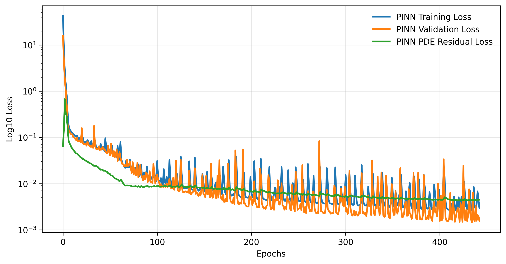
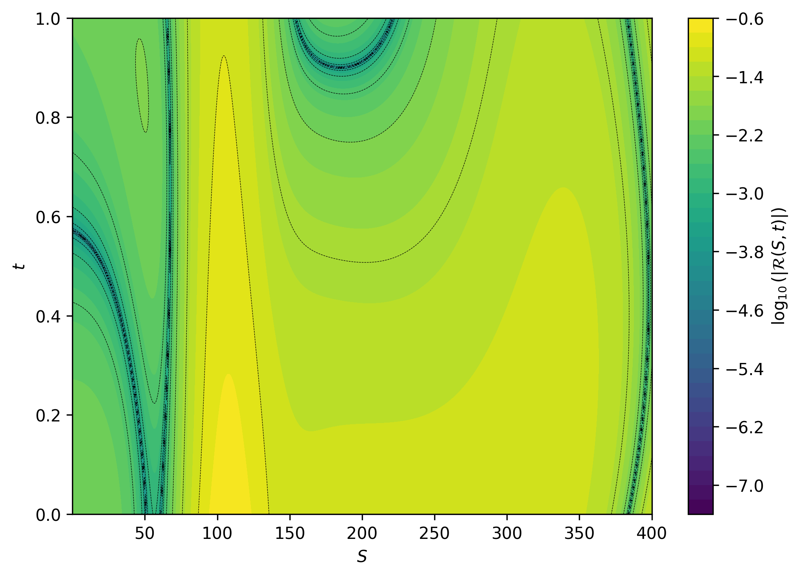

# Physics-Informed Neural Network for Local Volatility Option Pricing

This project develops a Physics-Informed Neural Network (PINN) to approximate solutions of the Black–Scholes partial differential equation with local volatility for European option pricing.

Training data are generated using a Crank–Nicolson finite difference solver under a parametric local volatility model. The PINN learns option price surfaces while enforcing the governing PDE, boundary conditions, and terminal payoff constraints through a composite loss function. Model performance is compared against a baseline neural network.

## Overview

This project develops a Physics-Informed Neural Network (PINN) to approximate solutions of the Black–Scholes partial differential equation with a parametric local volatility model for European option pricing.

Traditional neural networks trained only on data may violate the governing financial dynamics. A PINN incorporates the Black–Scholes PDE directly into the training objective, enforcing physical and financial constraints while learning option price surfaces.

Training data are generated using a Crank–Nicolson finite difference solver across randomly sampled volatility surfaces.

The model is evaluated against a baseline multilayer perceptron (MLP). Results show that the PINN significantly improves PDE consistency while maintaining comparable pricing accuracy.

## Black–Scholes PDE with Constant Volatility
Under the classical Black–Scholes model, the volatility σ is assumed to be constant. The option price V(S,t) satisfies:

$$ \frac{\partial V}{\partial t} + \frac{1}{2}\sigma^2 S^2 \frac{\partial^2 V}{\partial S^2} + rS \frac{\partial V}{\partial S} - rV = 0 $$

with terminal condition

$$
V(S,T)=\max(S-K,0)
$$

and boundary conditions

$$
V(0,t)=0
$$

$$
V(S,t)\to S-Ke^{-r(T-t)} \quad \text{as } S\to\infty
$$

In the constant-volatility case, the equation has a closed-form analytical solution for call and put options.

Call option price:

$$
C(S_t, t)=S_0N(d_1)-Ke^{-r(T-t)}N(d_2)
$$

Put option price:

$$
P(S_t, t)=Ke^{-r(T-t)}N(-d_2)-S_0N(-d_1)
$$

This analytical solution provides an important benchmark for numerical methods and machine learning models.

## Black–Scholes PDE with Local Volatility
However, empirical observations of financial markets show that volatility is not constant but varies with both the underlying asset price and time. This produces well-known phenomena such as the volatility smile and motivates the use of local volatility models, where the volatility parameter becomes a function σ(S,t). As a result, the Black-Scholes PDE becomes:

$$ \frac{\partial V}{\partial t} + \frac{1}{2}\sigma(S,t)^2 S^2 \frac{\partial^2 V}{\partial S^2} + rS \frac{\partial V}{\partial S} - rV = 0 $$

Unlike the constant-volatility case, the local-volatility Black–Scholes equation generally does not admit a closed-form analytical solution. As a result, numerical methods or machine learning approaches must be used to approximate the option price surface.

## Parametric Local Volatility Model
In this project the local volatility function is parameterized as

$$\sigma(S,t;\Phi)=\sigma_0\left[1+\alpha \tanh\\left(\beta \ln\frac{S}{K}\right)\right]\left(1+\gamma e^{-\eta t}\right)$$

where $$\Phi = (\sigma_0, \alpha, \beta, \gamma, \eta)$$ controls the dependence of volatility on asset price and time.

## Numerical Data Generation
Training data are generated by solving the Black–Scholes PDE under the local volatility model using the Crank–Nicolson
finite difference method. 

200 volatility surfaces are produced by randomly sampling the parameter $$\Phi$$ from predefined ranges to create diverse market scenarios. For each sampled parameter set, the solver computes the corresponding option price surface $$V(S,t)$$ using the Crank-Nicolson finite difference method. In this process, the spatial variable \(S\) and time variable \(t\) are discretized on a finite grid. The solver then averages the forward and backward time discretizations, making it second-order accurate and numerically stable method for parabolic PDEs. At each time step, the discretization results in a tridiagonal linear system for the option price values on the grid. This system is efficiently solved using the Thomas algorithm, which has linear computational complexity. The volatility surfaces are splitted into training and validation datasets; a separate testing dataset was generated independently to evaluate the model’s generalization ability.

To improve numerical stability during training, the input values are normalized:

• asset price and time are scaled to the interval [-1,1]  
• volatility parameters are standardized using training-set statistics  
• option prices are normalized by the strike price K

These normalization measures are applied consistently to the training, validation, and testing datasets.

## PINN Architecture

The Physics-Informed Neural Network is implemented as a fully connected multilayer perceptron that approximates the option pricing function

$$
V_\theta(S,t,\Phi)
$$

where \(S\) is the underlying asset price, \(t\) is time, and

$$
\Phi = (\sigma_0, \alpha, \beta, \gamma, \eta)
$$

is the parameter vector defining the local volatility surface.

The network takes seven input features:

$$
(S,t,\sigma_0,\alpha,\beta,\gamma,\eta)
$$

and outputs the predicted European call option value:

$$
\hat{V}(S,t,\Phi)
$$

The architecture used in the final model is:

- Input dimension: 7
- Hidden layers: 8
- Neurons per hidden layer: 64
- Activation function: `tanh`
- Output dimension: 1

The `tanh` activation function was used because it provides smooth derivatives, which is important for computing the first- and second-order derivatives required in the Black–Scholes PDE residual.

```text
(S, t, σ₀, α, β, γ, η)
          ↓
Fully Connected Layer
          ↓
8 Hidden Layers, 64 Neurons Each, tanh Activation
          ↓
Fully Connected Output Layer
          ↓
Predicted Option Price Vθ(S,t,Φ)
```
The network receives the spatial–temporal coordinates \((S,t)\) together with the local volatility parameters \(\Phi\), allowing a single model to learn option price surfaces across many market scenarios rather than fitting a single volatility surface.

## Physics-Informed Loss Function

Unlike a standard neural network trained only on labeled data, a Physics-Informed Neural Network (PINN) incorporates the governing differential equation directly into the optimization objective.

The model is trained using a composite loss function that combines supervised learning with financial constraints derived from the Black–Scholes equation.

### Interior Data Loss

The interior loss measures agreement between the network prediction and the numerical solution generated by the Crank–Nicolson solver:

$$
L_{\text{int}}=\frac{1}{N_{\text{int}}}\sum_{i=1}^{N_{\text{int}}}\left(V_\theta(S_i,t_i,\Phi_i)-V_i^{\text{CN}}\right)^2
$$

where the target value is obtained from the Crank–Nicolson finite difference solver.

### Boundary Condition Loss

The Black–Scholes PDE satisfies the boundary conditions

$$
V(0,t)=0
$$

and

$$
V(S,t)\approx S-Ke^{-r(T-t)} \quad \text{for large } S.
$$

The boundary loss penalizes violations of these constraints:

$$
L_{\text{bc}}=\frac{1}{N_{\text{bc}}}\sum_{i=1}^{N_{\text{bc}}}\left(V_\theta^{(i)}-V_{\text{bc}}^{(i)}\right)^2.
$$

### Terminal Payoff Loss

At option maturity, the solution must satisfy the European call payoff:

$$
V(S,T)=\max(S-K,0).
$$

The terminal-condition loss is

$$
L_{\text{term}}=\frac{1}{N_{\text{term}}}\sum_{i=1}^{N_{\text{term}}}\left(V_\theta(S_i,T,\Phi_i)-\max(S_i-K,0)\right)^2.
$$

### PDE Residual Loss

The Black–Scholes residual is defined as

$$
R(S,t,\Phi)=\frac{\partial V_\theta}{\partial t}+\frac{1}{2}\sigma(S,t;\Phi)^2S^2\frac{\partial^2 V_\theta}{\partial S^2}+rS\frac{\partial V_\theta}{\partial S}-rV_\theta.
$$

The required derivatives are computed using automatic differentiation.

The PDE loss is

$$
L_{\text{pde}}=\frac{1}{N_{\text{pde}}}\sum_{i=1}^{N_{\text{pde}}}R(S_i,t_i,\Phi_i)^2.
$$

### Total Loss Function

The overall training objective combines all four components:

$$
L=\lambda_{\text{int}}L_{\text{int}}+\lambda_{\text{bc}}L_{\text{bc}}+\lambda_{\text{term}}L_{\text{term}}+\lambda_{\text{pde}}L_{\text{pde}}.
$$

The weighting coefficients control the tradeoff between fitting the numerical training data and enforcing the governing financial dynamics. During hyperparameter tuning, multiple values of the PDE weight were evaluated to balance prediction accuracy and PDE satisfaction.

## Training Procedure

The PINN was trained using the Adam optimizer with mini-batch gradient descent. During each training iteration, batches were sampled separately from the interior, boundary, and terminal datasets. The network parameters were updated by minimizing the composite loss function consisting of the interior data loss, boundary condition loss, terminal payoff loss, and PDE residual loss.

Automatic differentiation in PyTorch was used to compute the first- and second-order derivatives required for evaluating the Black–Scholes PDE residual. These derivatives were incorporated directly into the training objective, allowing the model to learn solutions that satisfy both the numerical training data and the governing financial dynamics.

Model performance was monitored using a validation dataset generated from independent local volatility surfaces. The model achieving the lowest validation loss was saved as the final checkpoint. Early stopping was applied to prevent overfitting and preserve the best-performing model.

### Training Configuration

| Parameter | Value |
|------------|---------|
| Optimizer | Adam |
| Hidden Layers | 8 |
| Hidden Units | 64 |
| Activation Function | tanh |
| Learning Rate | 1e-3 |
| Maximum Epochs | 500 |
| Early Stopping | Enabled |
| Model Selection | Lowest Validation Loss |

The final model was selected based on validation performance and subsequently evaluated on an independently generated testing dataset to assess generalization across unseen volatility surfaces.

## Hyperparameter Tuning

Several hyperparameters were systematically tuned to balance pricing accuracy and PDE satisfaction. Model selection was based on validation performance, with particular attention paid to the tradeoff between supervised prediction error and enforcement of the Black–Scholes equation.

### Learning Rate

The learning rate was varied to evaluate optimization stability and convergence speed.

| Learning Rate |
|---------------|
| 1e-3 |
| 5e-4 |
| 2e-4 |

Among the tested values, a learning rate of **1e-3** achieved the best balance between convergence speed and validation performance and was selected for the final model.

### Network Architecture

The depth of the neural network was varied to investigate the effect of model capacity on approximation quality.

| Hidden Layers | Hidden Units |
|---------------|--------------|
| 4 | 64 |
| 6 | 64 |
| 8 | 64 |

Increasing network depth generally improved the model's ability to represent complex option price surfaces. The final architecture consisted of **8 hidden layers with 64 neurons per layer**.

### PDE Loss Weight

The PDE loss weight controls the relative importance of enforcing the governing equation during training.

| PDE Weight (\(\lambda_{pde}\)) |
|-------------------------------|
| 0.3 |
| 1 |
| 3 |
| 10 |

Smaller values placed greater emphasis on fitting the numerical training data, while larger values prioritized satisfaction of the Black–Scholes equation.

A PDE weight of **1** provided the most effective balance between prediction accuracy and physical consistency. Lower weights reduced supervised error but produced larger PDE residuals, whereas higher weights enforced the governing equation more strongly at the cost of pricing accuracy.

### Final Hyperparameters

| Parameter | Selected Value |
|------------|---------------|
| Hidden Layers | 8 |
| Hidden Units | 64 |
| Activation Function | tanh |
| Learning Rate | 1e-3 |
| PDE Weight (\(\lambda_{pde}\)) | 1 |
| Optimizer | Adam |
| Maximum Epochs | 500 |

The final model configuration was chosen based on validation performance and was subsequently evaluated on an independently generated testing dataset.

## Results

### Comparison with Baseline MLP

To evaluate the benefit of physics-informed learning, the proposed PINN was compared with a baseline multilayer perceptron (MLP) trained using supervised data only. Both models used the same neural network architecture; however, the PINN incorporated additional loss terms enforcing the Black–Scholes PDE together with boundary and terminal constraints.

| Model | Interior RMSE | BC RMSE | Terminal RMSE | PDE RMS |
|---------|---------|---------|---------|---------|
| Baseline MLP | 0.0028 | 0.0034 | 0.0031 | 0.1235 |
| PINN | 0.0030 | 0.0021 | 0.0020 | 0.0677 |

The baseline MLP achieved slightly lower interior prediction error, reflecting its ability to interpolate the numerical training data. However, the PINN substantially improved physical consistency.

In particular, the PDE residual RMS was reduced from **0.1235** to **0.0677**, corresponding to approximately a **45% improvement in PDE satisfaction** while maintaining comparable pricing accuracy.

These results demonstrate that incorporating financial constraints directly into the training process can significantly improve adherence to the governing Black–Scholes dynamics.

---

### Training Behavior

The training and validation losses decreased steadily throughout optimization, indicating stable convergence of the PINN.

The PDE residual loss also decreased during training, showing that the network progressively learned solutions that better satisfied the Black–Scholes equation.

Early stopping and validation-based checkpoint selection helped prevent overfitting while preserving the best-performing model.

<p align="center">
  
</p>

*Figure 1. Training and validation loss curves during PINN optimization.*

---

### PDE Residual Analysis

To further evaluate physical consistency, the PDE residual was computed across the spatial–temporal domain after training.

The residual magnitude

$$
\log_{10}(|R(S,t)|)
$$

was evaluated on the original (unnormalized) asset-price and time coordinates.

<p align="center">
  
</p>

*Figure 2. Spatial distribution of the PDE residual magnitude.*

The residual generally remained between approximately \(10^{-3}\) and \(10^{-1}\) throughout the domain. Larger residual values appeared in regions where the option price surface exhibited stronger curvature, while smaller residual regions indicated better satisfaction of the governing equation.

Overall, the residual heatmap confirms that the PINN successfully captures the underlying structure of the local-volatility Black–Scholes PDE while maintaining consistency with the imposed financial constraints.

---

### Key Takeaways

- PINNs successfully incorporate financial dynamics directly into the learning process.
- PDE residual RMS was reduced by approximately **45%** relative to a supervised baseline.
- Boundary and terminal condition errors were also improved.
- Pricing accuracy remained comparable to a standard neural network despite the additional physics-based constraints.
- The resulting model produced solutions that better satisfied the governing Black–Scholes equation across the entire domain.

## Visualizations

### PDE Residual Heatmap

To evaluate physical consistency, the PDE residual was computed across the spatial–temporal domain after training. The heatmap below visualizes the magnitude of the Black–Scholes PDE residual,

$$
\log_{10}(|R(S,t)|),
$$

where \(R(S,t)\) denotes the PDE residual evaluated using the trained PINN solution.

<p align="center">
  
</p>

<p align="center">
  <em>Figure 1. Spatial distribution of the PDE residual magnitude for the trained PINN.</em>
</p>

The residual remains relatively small throughout most of the domain, indicating that the learned solution closely satisfies the governing Black–Scholes equation.

---

### Reference Option Price Surface

The figure below shows a representative option price surface generated using the Crank–Nicolson finite difference solver under the local volatility model. This numerical solution serves as the ground-truth reference used for training and evaluation.

<p align="center">
  
</p>

<p align="center">
  <em>Figure 2. Reference option price surface generated using the Crank–Nicolson solver.</em>
</p>

The surface exhibits nonlinear dependence on both asset price and time due to the local volatility structure incorporated into the Black–Scholes equation.

---

### PINN Predicted Surface

The figure below shows the corresponding option price surface predicted by the trained PINN.

<p align="center">
  
</p>

<p align="center">
  <em>Figure 3. Option price surface predicted by the Physics-Informed Neural Network.</em>
</p>

The predicted surface closely matches the reference solution while simultaneously satisfying the governing PDE through the physics-informed loss function.

---

### Surface Comparison

Comparing Figures 2 and 3 demonstrates that the PINN successfully captures the overall structure of the option pricing surface across the spatial–temporal domain. Despite being trained on a finite set of numerical solutions, the model produces smooth predictions that remain consistent with both the training data and the underlying financial dynamics.

These visualizations complement the quantitative results presented in the previous section and provide qualitative evidence of the PINN's ability to approximate solutions of the local-volatility Black–Scholes equation.
